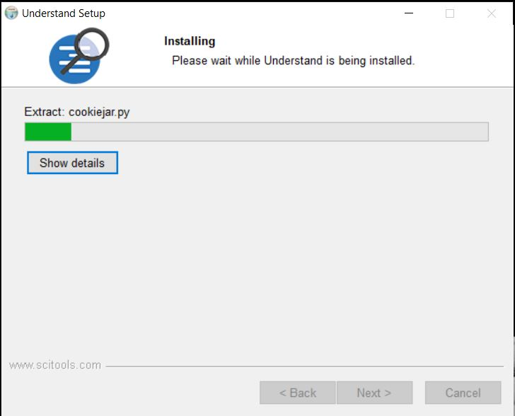
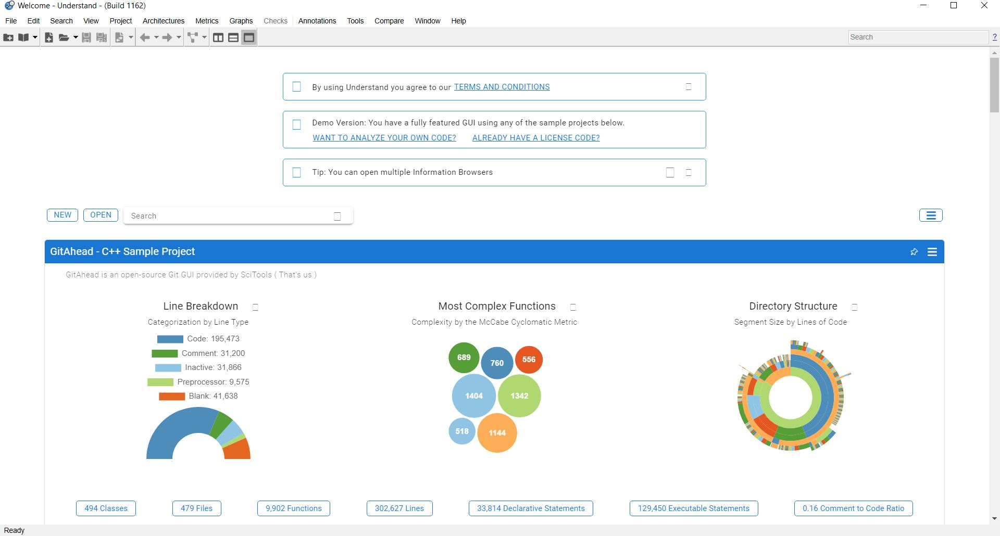
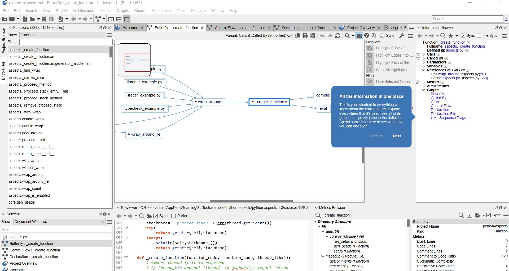

# Setting up Scientific Toolworks Understand

## What is Understand?

Scientific Toolworks Understand is a powerful static analysis software designed for the protection, measurement, and critical analysis of large programming code bases. This program boasts the ability to recognize cross-platforms, support multiple languages, and cater to maintenance-oriented programming environments, such as interactive development environments (IDEs). Understand is crafted to facilitate the maintenance and creation of source code, supporting languages such as C++, C#, FORTRAN, Java, JOVIAL, or Delphi/Pascal. It excels in recognizing relationships and structures within software projects.

## Download Instructions

Visit [Scientific Toolworks](https://scitools.com/) to download the installation files. Follow the installation process by clicking "Next" in the setup wizard.



After installation, open the program, and you'll be greeted with this window:



You are now ready to commence your project.

🥳




# Setting up ANTLR

## Step 1: Download Java

Before using ANTLR, ensure you have Java installed. Download it from [here](https://www.java.com/download/ie_manual.jsp).

## Step 2: Download ANTLR

Visit the [ANTLR official website](https://www.antlr.org/) or go directly to the [Download ANTLR](https://www.antlr.org/download.html) page. Download the [ANTLR tool itself](https://www.antlr.org/download/antlr-4.13.1-complete.jar).

## Step 3: Install ANTLR for Python

If you intend to use ANTLR with Python, follow these steps:

1. Download Python from [Python Downloads](https://www.python.org/downloads/).
2. Install Pip by following the instructions [here](https://www.geeksforgeeks.org/how-to-install-pip-on-windows/).

Create a `requirements.txt` file containing the necessary packages, including a reference to the Antlr Python3 runtime:

```plaintext
antlr4-python3-runtime==4.13.0
```

Additionally, provide a build script (e.g., `build.sh`) that builds the program:

```bash
pip install -r requirements.txt
antlr4 -v 4.13.0 -Dlanguage=Python3 Expr.g4
```