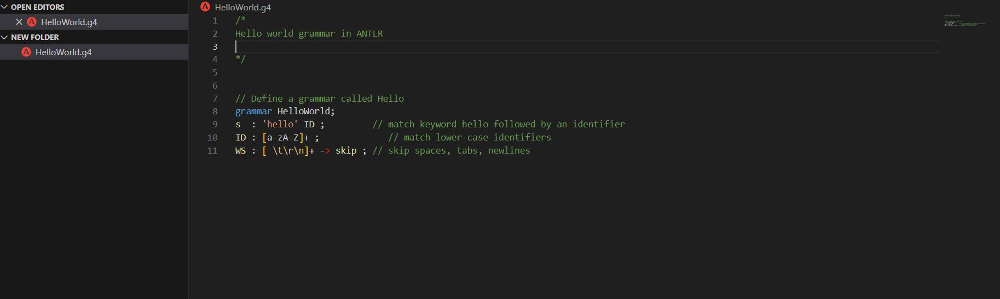
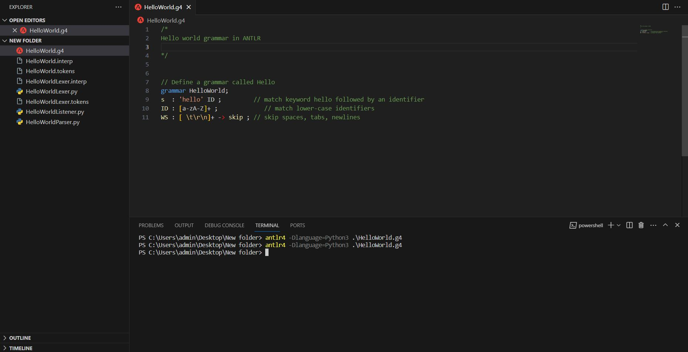

# README for Hello World Grammar in ANTLR

## Overview

This repository contains the implementation of a simple "Hello World" grammar using ANTLR (ANother Tool for Language Recognition). ANTLR is a powerful parser generator that can be used to define grammars for various programming languages and other languages.

## Files

- **HelloWorld.g4**: This is the main file containing the ANTLR grammar specification. It defines a grammar named "HelloWorld" that recognizes a simple language construct with the keyword "hello" followed by an identifier.

## Grammar Rules

The grammar rules are defined as follows:

- **s**: This rule represents the main entry point for the parser. It matches the sequence "hello" followed by an identifier (ID).
  
- **ID**: This rule defines the structure of identifiers. In this grammar, an identifier is composed of one or more alphabetical characters (both lowercase and uppercase).

- **WS**: This rule skips spaces, tabs, and newlines. It ensures that whitespace does not affect the parsing process.

## How to Use

To generate the parser code from the grammar specification, you need to use the ANTLR tool. Follow these steps:

1. Install ANTLR: Follow the installation instructions for ANTLR from the official [ANTLR website](https://www.antlr.org/).

2. Generate Parser Code: Run the following command to generate the parser code in your terminal:

   ```bash
   antlr4 HelloWorld.g4
   ```

3. Compile Generated Code: Compile the generated code, which includes lexer and parser classes. The exact command may vary based on your programming language.

4. Use the Generated Parser: Incorporate the generated parser into your application to parse input strings according to the defined grammar.


or you can just write this in terminal:

```bash
antlr4 -Dlanguage=Python3 .\HelloWorld.g4

```
## Before Generate
before generate we just write ANTLR codes and we have:

# <center> 

## After Generate
After generate, ANTLER generate the files automaticly and we have:

# <center> 


## License

This project is licensed under the [MIT License](LICENSE). Feel free to modify and use it according to your needs.

