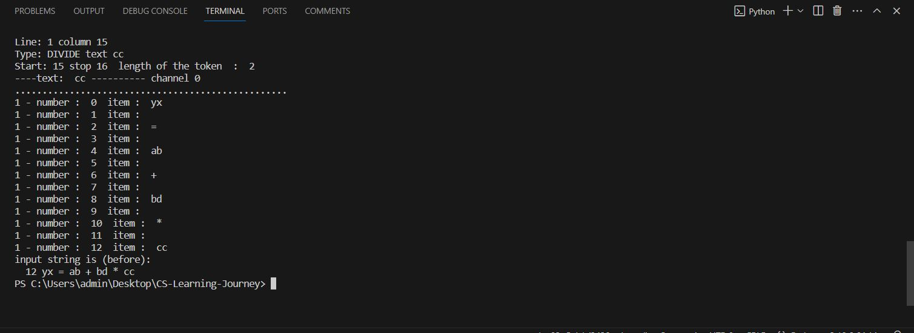

# HW_2: Grammar and Parser 📚

This project contains a simple grammar for mathematical expressions named "Expr1" and its corresponding parser implemented in Python using the ANTLR4 tool. The grammar supports basic mathematical operations such as addition, subtraction, multiplication, and division, as well as parentheses to control the order of operations.

## main Files

### main.py

This file contains the main script for the Expr1 grammar. It reads an input mathematical expression, tokenizes it using the Expr1 lexer, parses it using the Expr1 parser, and then performs some operations on the generated parse tree.

### main.g4

This file defines the Expr1 grammar using ANTLR4's grammar syntax. It includes rules for mathematical expressions, assignments, and various mathematical operations.

### mainLexer.py

This file contains the lexer generated by ANTLR4 based on the Expr1 grammar. It tokenizes input strings into meaningful tokens for further parsing.

### mainParser.py

This file contains the parser generated by ANTLR4 based on the Expr1 grammar. It parses the token stream generated by the lexer and builds a parse tree.

### mainListener.py

This file defines a listener class for the Expr1 parser. It inherits from the ANTLR-generated `ParseTreeListener` class and can be extended to perform actions while traversing the parse tree.

## Usage

1. Install ANTLR4: Follow the [official installation instructions](https://github.com/antlr/antlr4/blob/master/doc/getting-started.md).

2. Generate Lexer and Parser: Run the following commands in the terminal to generate the lexer and parser files from the main.g4 grammar:

   ```bash
   antlr4 -Dlanguage=Python3 -no-listener -visitor main.g4
   ```

3. Run main.py: Execute the main script to test the Expr1 grammar on a sample input.

   ```bash
   python main.py
   ```

## 👉 Additional Notes

- The grammar supports basic mathematical expressions, but it can be extended to include more features as needed.
- The generated lexer and parser files (mainLexer.py and mainParser.py) should not be manually modified, as they are automatically generated by ANTLR4.

## initial out
 
you can see this output in first run this mudul:

# <center> 