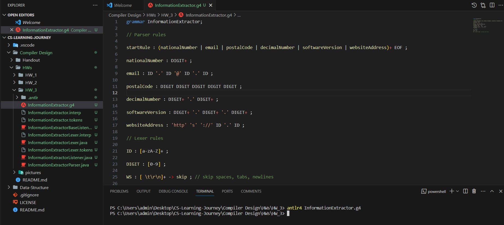

# Information Extractor Compiler

## Overview

This project implements a simple ANTLR (ANother Tool for Language Recognition) grammar in a `.g4` file for extracting specific information from a given text input. The grammar is designed to recognize and display national numbers, emails, postal codes, decimal numbers, software versions, and website addresses.

## Usage

To use the Information Extractor Compiler, follow these steps:

1. **Install ANTLR:**
   Make sure you have ANTLR installed on your system. You can download it from [ANTLR website](https://www.antlr.org/).

2. **Clone the Repository:**
   Clone this repository to your local machine.

   ```bash
   git clone https://github.com/MR-ARMA/CS-Learning-Journey.git
   ```

3. **Generate Lexer and Parser:**
   Use the ANTLR tool to generate lexer and parser classes from the provided grammar file (`InformationExtractor.g4`).

   ```bash
   antlr4 InformationExtractor.g4
   ```

4. **Compile and Run:**
   Compile the generated lexer and parser classes along with your main program. Ensure you have the necessary runtime libraries.

   ```bash
   javac InformationExtractor*.java YourMainProgram.java
   ```

   Run your program:

   ```bash
   java YourMainProgram input.txt
   ```

## Example

### Before Generate


### After Generate



## Explanation

The grammar (`InformationExtractor.g4`) defines parser rules for the extraction of national numbers, emails, postal codes, decimal numbers, software versions, and website addresses. Lexer rules handle the identification of identifiers (`ID`) and digits (`DIGIT`), while whitespace is skipped.

## License

This project is licensed under the MIT License - see the [LICENSE](LICENSE) file for details.

## Acknowledgments

- [ANTLR - ANother Tool for Language Recognition](https://www.antlr.org/)
