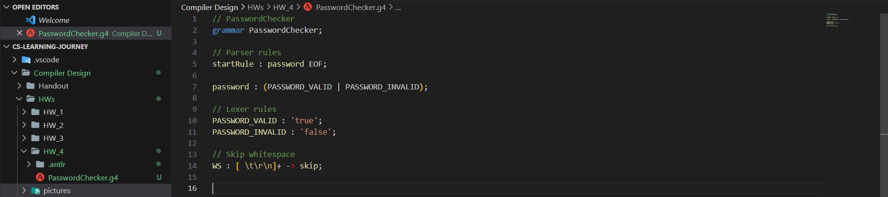
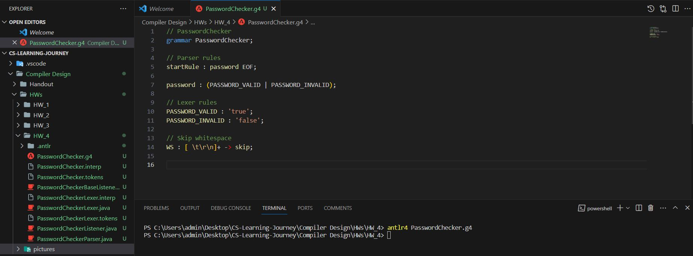

# Password Checker Compiler

## Overview

This project implements a simple ANTLR (ANother Tool for Language Recognition) grammar in a `.g4` file for checking the validity of a password. The grammar checks if the entered password meets certain criteria, including being at least 8 digits long, containing at least one symbol, and having an uppercase English letter. The program returns `true` if the password is valid and `false` otherwise.

## Usage

To use the Password Checker Compiler, follow these steps:

1. **Install ANTLR:**
   Make sure you have ANTLR installed on your system. You can download it from [ANTLR website](https://www.antlr.org/).

2. **Clone the Repository:**
   Clone this repository to your local machine.

   ```bash
   git clone https://github.com/MR-ARMA/CS-Learning-Journey.git
   ```

3. **Generate Lexer and Parser:**
   Use the ANTLR tool to generate lexer and parser classes from the provided grammar file (`PasswordChecker.g4`).

   ```bash
   antlr4 PasswordChecker.g4
   ```

4. **Compile and Run:**
   Compile the generated lexer and parser classes along with your main program. Ensure you have the necessary runtime libraries.

   ```bash
   javac PasswordChecker*.java YourMainProgram.java
   ```

   Run your program:

   ```bash
   java YourMainProgram input.txt
   ```

## Example

### Valid Password

```
true
```

### Invalid Password

```
false
```

## Explanation

The grammar (`PasswordChecker.g4`) defines a rule (`password`) to check if the entered password is valid (`PASSWORD_VALID`) or invalid (`PASSWORD_INVALID`). Lexer rules define the two possible outcomes (`true` and `false`).

In a real-world scenario, you would integrate this grammar with your code to perform the actual password validation based on the specified criteria.


### before generate:



### after generate:



## License

This project is licensed under the MIT License - see the [LICENSE](LICENSE) file for details.

## Acknowledgments

- [ANTLR - ANother Tool for Language Recognition](https://www.antlr.org/)

