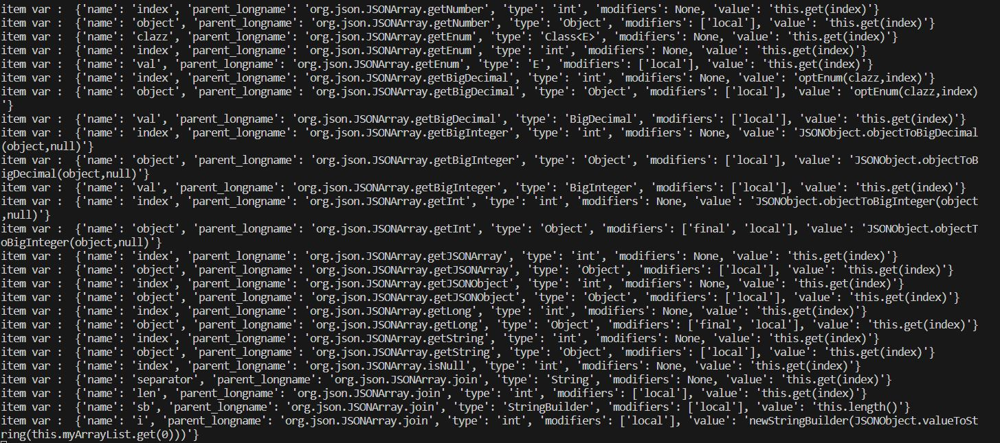
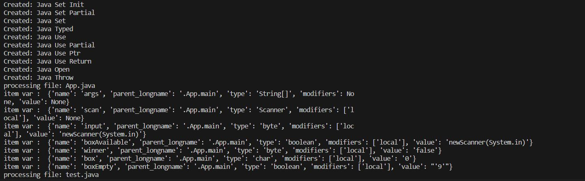
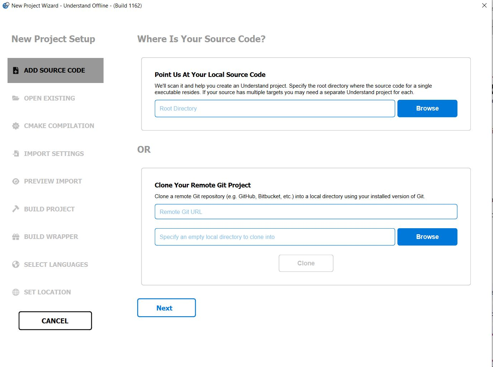
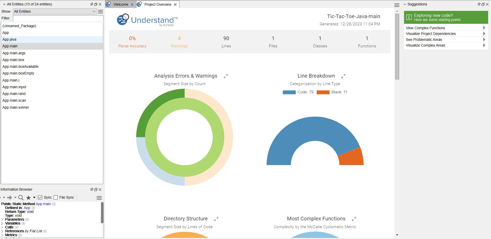

# The comparison between understand and openunderstand worked

For this, we will first work with the _openunderstand_ program, which is an open source program.

## How to start openunderstand software

1. First, enter the following command in the terminal of your system:


```bash
bash git clone git@github.com:m-zakeri/OpenUnderstand.git
```

2. Then enter the following command so that all branches of the program are fetched.

```bash
bash git fetch
```

3. After that, use the following command to change the status to the dev branch.

```bash
bash git checkout origin dev

```

4. Then create a virtualenv and activate it.
5. After that, install the required libraries with the command txt.requirements r-install pip.

Now the software is ready to run.

To create a table of symbols in the root part of the software, a file named `py.openunderstand_test` is created and the following code is put in it.


```python 
import sys 
from os import getcwd 
from os.path import join 
sys.path.append(join(getcwd(), "openunderstand")) 
sys.path.append(join(getcwd(), "openunderstand", "oudb")) 
sys.path.append(join(getcwd(), "openunderstand", "utils")) 
from openunderstand.ounderstand.openunderstand import * 
start_parsing( 
    repo_address=join(getcwd(), "benchmark", "JSON"), 
    db_address=getcwd(), 
    db_name="mydb.udb", 
    engine_core="Python3", 
    log_address=join(getcwd(), "app.log") 
)
```

> Note that if you use the dev fork, it will automatically build it.

After running, a file called `log.app` is created in the root part of the program, which has the following content.




Also, a database called `udb.mydb` is created, which has four tables.

Now, to call the APIs, we create another file named `py.api_test` and put the following code in it.


```python
 import sys 
 from os import getcwd 
 from os.path import join 
 sys.path.append(join(getcwd(), "openunderstand")) 
 sys.path.append(join(getcwd(), "openunderstand", "oudb")) 
 sys.path.append(join(getcwd(), "openunderstand", "utils")) 

 import openunderstand.ounderstand as und 
 
 
_db = und.open("/home/y/Desktop/iust/OpenUnderstand/mydb.udb") 
print( 
    len( 
        _db.ent("class") 
    ) 
)
 ```


This code will output the number 456.

> Note that the `und.open()` input argument must be equal to the location of your database.


To run and test an example of the tic-tac-toe file, which is in Java language, we first create a file in `OpenUnderstand\benchmark\` called `test` and put the game code in it. The game code is placed and saved.


### java Tic_tac_toe code:
```java
import java.util.Scanner;

public class App {

    public static void main(String[] args) {
        Scanner scan = new Scanner(System.in);
        byte input;
        byte rand;
        byte i;
        boolean boxAvailable = false;
        byte winner = 0;
        char box[] = { '1', '2', '3', '4', '5', '6', '7', '8', '9' };
        System.out.println("Enter box number to select. Enjoy!\n");

        boolean boxEmpty = false;
        while (true) {
            System.out.println("\n\n " + box[0] + " | " + box[1] + " | " + box[2] + " ");
            System.out.println("-----------");
            System.out.println(" " + box[3] + " | " + box[4] + " | " + box[5] + " ");
            System.out.println("-----------");
            System.out.println(" " + box[6] + " | " + box[7] + " | " + box[8] + " \n");
            if(!boxEmpty){
                for(i = 0; i < 9; i++)
                    box[i] = ' ';
                boxEmpty = true;
            }

            if(winner == 1){
                System.out.println("You won the game!\nCreated by Shreyas Saha. Thanks for playing!");
                break;
            } else if(winner == 2){
                System.out.println("You lost the game!\nCreated by Shreyas Saha. Thanks for playing!");
                break;
            } else if(winner == 3){
                System.out.println("It's a draw!\nCreated by Shreyas Saha. Thanks for playing!");
                break;
            }

            while (true) {
                input = scan.nextByte();
                if (input > 0 && input < 10) {
                    if (box[input - 1] == 'X' || box[input - 1] == 'O')
                        System.out.println("That one is already in use. Enter another.");
                    else {
                        box[input - 1] = 'X';
                        break;
                    }
                }
                else
                    System.out.println("Invalid input. Enter again.");
            }

            if((box[0]=='X' && box[1]=='X' && box[2]=='X') || (box[3]=='X' && box[4]=='X' && box[5]=='X') || (box[6]=='X' && box[7]=='X' && box[8]=='X') ||
               (box[0]=='X' && box[3]=='X' && box[6]=='X') || (box[1]=='X' && box[4]=='X' && box[7]=='X') || (box[2]=='X' && box[5]=='X' && box[8]=='X') ||
               (box[0]=='X' && box[4]=='X' && box[8]=='X') || (box[2]=='X' && box[4]=='X' && box[6]=='X')){
                   winner = 1;
                   continue;
            }

            boxAvailable = false;
            for(i=0; i<9; i++){
                if(box[i] != 'X' && box[i] != 'O'){
                    boxAvailable = true;
                    break;
                }
            }

            if(boxAvailable == false){
                winner = 3;
                continue;
            }

            while (true) {
                rand = (byte) (Math.random() * (9 - 1 + 1) + 1);
                if (box[rand - 1] != 'X' && box[rand - 1] != 'O') {
                    box[rand - 1] = 'O';
                    break;
                }
            }

            if((box[0]=='O' && box[1]=='O' && box[2]=='O') || (box[3]=='O' && box[4]=='O' && box[5]=='O') || (box[6]=='O' && box[7]=='O' && box[8]=='O') ||
               (box[0]=='O' && box[3]=='O' && box[6]=='O') || (box[1]=='O' && box[4]=='O' && box[7]=='O') || (box[2]=='O' && box[5]=='O' && box[8]=='O') ||
               (box[0]=='O' && box[4]=='O' && box[8]=='O') || (box[2]=='O' && box[4]=='O' && box[6]=='O')){
                winner = 2;
                continue;
            }
        }

    }
}

```


In the `test_openunderstand.py` section, change the following sections:
- `repo_address=join(getcwd(), "benchmark", "JSON")` to `repo_address=join(getcwd(), "benchmark", "test")`
- `log_address=join(getcwd(), "a.log")` to `log_address=join(getcwd(), "test.log")`

After implementing these changes, we get the following output:



After the files were generated, in the `test_api.py` section, change the following code:
- `_db = und.open(r"C:\Users\admin\Desktop\OpenUnderstand\mydb.udb")` to `_db = und.open(r"C:\Users\admin\Desktop\OpenUnderstand\test.udb")`

After running this, the output is equal to the number `6`.


and in the end, when we write this line code in the end of "test_run.py" file, We take the number `6`

```python
print(len(_db.ents("Class")))

```


## work on the Understand

# Work Review in the Understand Scitools Program

After installing the Understand program, you can crack it for free use. You can open a new project by navigating to `File > New < Project`. Once you've done this, you'll see a page similar to the one shown in the picture below:



You can either clone a repository from GitHub or load it from a local location. Once you've done this, your review is ready.

Let's consider the case where we review the same tic-tac-toe file. The page would look like this:



As you can see, different numbers appear, and the class value equals the number ÷.

