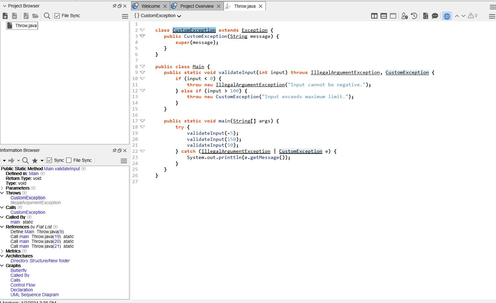
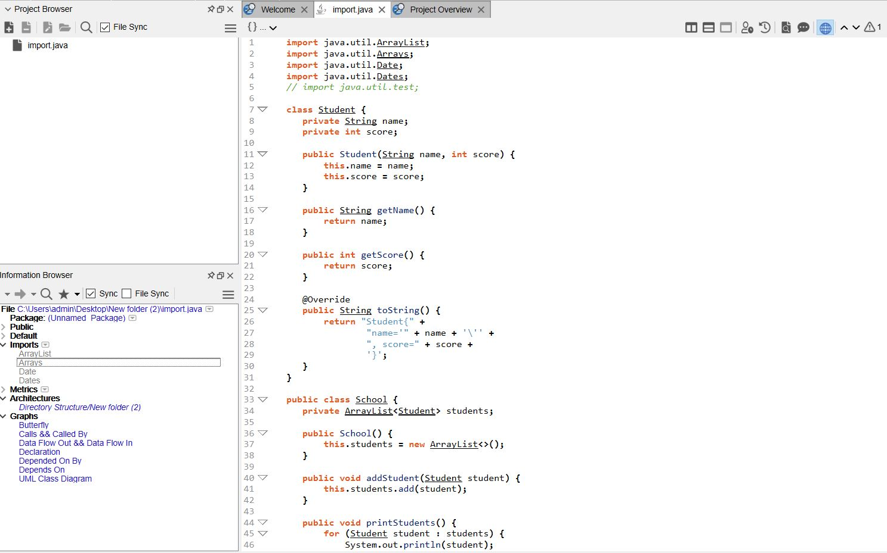
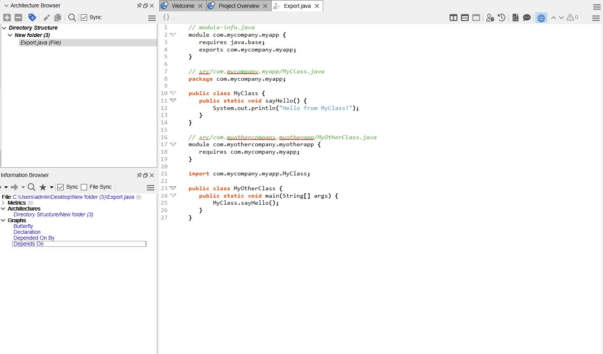
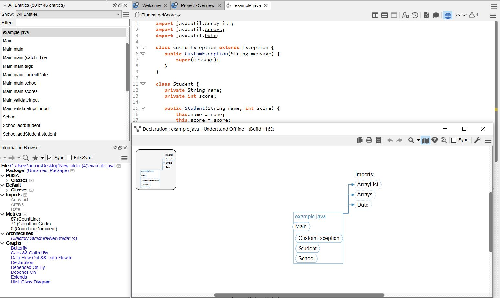
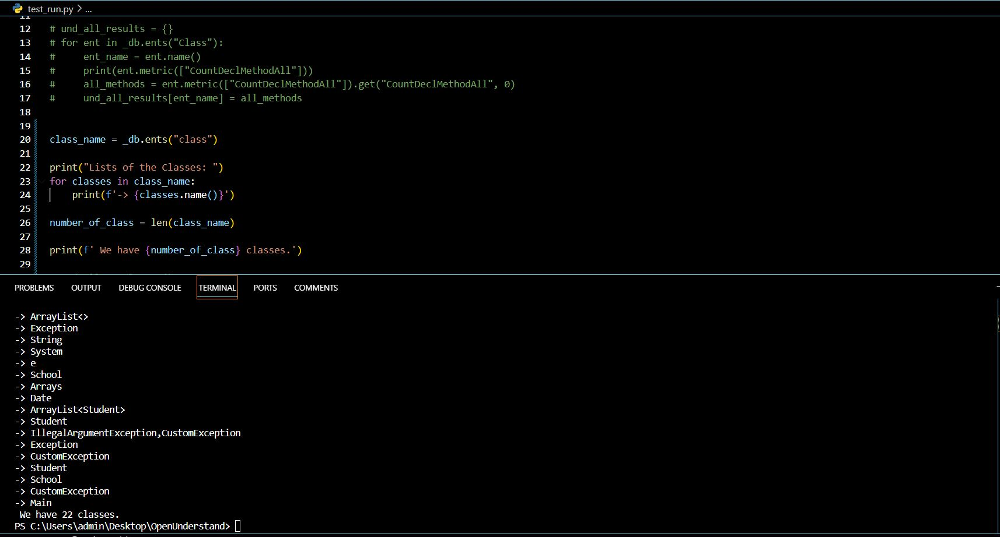
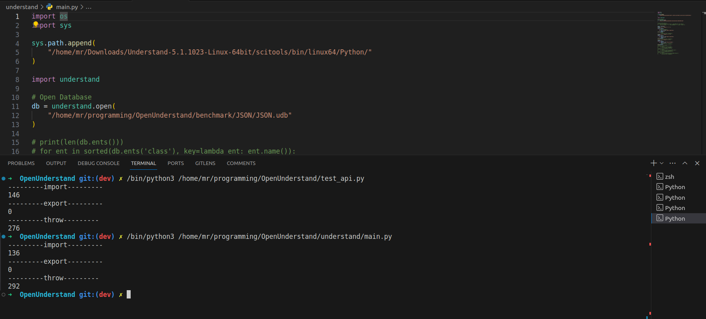

# <center> Explain Throw, Export and Import in Java


# <center>


\
\
\
\

# Throw and Trows

# <center>


1. **Throw**: The `throw` keyword is used to explicitly throw an exception from a method or a block of code. When an exception is thrown, it creates an object and hands it off to the runtime system. This object, called an exception object, contains information about the error, including its type and the state of the program when the error occurred. This process is known as "throwing an exception". Here is an example of how to use the `throw` keyword:

```java
public void checkAge(int age) throws AgeException {
   if (age < 18) {
       throw new AgeException("Too young!");
   }
   else if (age >= 18 && age <= 25) {
       throw new AgeException("That's good, but not much!!!");
   }
}

```
In this example, if the age is less than 18, an `AgeException` is thrown with the message "Too young!". The `throws` keyword is then used in the method signature to indicate that this method might throw an `AgeException`.

2. **Throws**: The `throws` keyword is used in the signature of a method to indicate that this method might throw one of the listed type exceptions. The caller to these methods has to handle the exception using a try-catch block. For example:

```java
public void checkAge(int age) throws AgeException {
   // ...
}

public static void main(String[] args) {
   try {
       checkAge(16);
   } catch (AgeException e) {
       System.out.println(e.getMessage());
   }
}
```
In this example, the `checkAge` method declares that it might throw an `AgeException`. In the `main` method, we call `checkAge` inside a try block and handle the potential `AgeException` in the catch block.

### Example Whit Analyse

In [**this code**](../HW_6/Throw_Code.java) we used `throw` of Java Syntax 


#### **Analys Trow in code**


The `throw` keyword in the provided code is used to explicitly throw exceptions based on certain conditions. Let's break down the relevant parts of the code:

1. **Class Definition**: The `Main` class is defined, which contains the `validateInput` method and the `main` method.

2. **validateInput Method**: This method accepts an integer as an argument and throws different types of exceptions based on the value of the input.

  - If the input is less than 0, it throws an `IllegalArgumentException` with the message "Input cannot be negative."
  
  - If the input is greater than 100, it throws a `CustomException` with the message "Input exceeds maximum limit."

3. **main Method**: This is the entry point of the program. It calls the `validateInput` method three times with different arguments. Each call is wrapped in a try-catch block to handle any exceptions that might be thrown.

In the `validateInput` method, the `throw` keyword is used to throw exceptions based on the input value. When an exception is thrown, the normal flow of the program is interrupted, and control is immediately transferred to the nearest matching catch block. If no matching catch block is found, the program terminates.

#### Analyse Throw in Understand Scitools

# <center>


# Import and Export

# <center>


## Import

The `import` keyword is used to bring certain classes, interfaces, enumerations, or other entities into visibility. Without import, you would need to use the fully qualified name of the entity every time you referenced it. Here is an example:

```java
import java.util.ArrayList;

public class MyClass {
   public static void main(String[] args) {
       ArrayList<Integer> numbers = new ArrayList<>();
       // ...
   }
}
```
In this example, we import the `ArrayList` class from the `java.util` package, allowing us to use `ArrayList` without specifying the full package path.


## Example Whit Analyse


In [**this code**](../HW_6/Import_Code.java) we used `import` of Java Syntax 


#### **Analys import in code**

In the provided code, the `import` keyword is used to import classes from the `java.util` package. Here's how it works:

1. **Import Statements**: At the beginning of the code, three import statements are made:

```java
import java.util.ArrayList;
import java.util.Arrays;
import java.util.Date;
```

Each of these lines brings a class (`ArrayList`, `Arrays`, and `Date`) from the `java.util` package into scope. This means that you can use these classes in your code without having to specify their full package paths.

2. **Usage of Imported Classes**: After importing, you can use the `ArrayList`, `Arrays`, and `Date` classes directly in your code. For example, in the `School` class, an `ArrayList` is used to store `Student` objects:

```java
private ArrayList<Student> students;
```

And in the `main` method, an `Arrays` object is used to sort an array of scores, and a `Date` object is used to represent the current date:

```java
int[] scores = {85, 90, 95};
Arrays.sort(scores);
...
Date currentDate = new Date();
```

Without the import statements, you would have to use the full package paths to use these classes, which would make your code more verbose and harder to read.

#### Analyse import in Understand Scitools

# <center>


## Export

The term "export" is not directly related to Java. However, in the context of modularization in Java 9 and later versions, you might hear about "exports" in the module descriptor file (`module-info.java`). The `exports` directive makes the named package accessible to other modules. For example:

```java
module myModule {
   exports com.mycompany.myapp;
}
```
In this example, the `com.mycompany.myapp` package is exported, making it accessible to other modules.


## Example Whit Analyse

In [**this code**](../HW_6/Export_Code.java) we used `throw` of Java Syntax 


#### **Analyse export in code**

In the provided code, the `export` keyword is used in the `module-info.java` file to make the `com.mycompany.myapp` package accessible to other modules. Here's how it works:

1. **Module Declaration**: The `module-info.java` file is where we declare the module and its dependencies. In this case, the module is `com.mycompany.myapp`, and it depends on the `java.base` module, which is a fundamental module containing basic classes and interfaces.


```java
module com.mycompany.myapp {
  requires java.base;
  exports com.mycompany.myapp;
}
```

2. **Exports Directive**: The `exports` directive makes the `com.mycompany.myapp` package accessible to other modules. This means that other modules can use the classes and interfaces defined in the `com.mycompany.myapp` package.

By default, the public types of a module are not visible outside the module. To make them accessible from other modules, we must export the package containing these types. Note that sub-packages are not automatically exported.

This `export` directive allows other modules to use the `com.mycompany.myapp` package, as shown in the `com.myothercompany.myotherapp` module in the subsequent code snippet.


#### Analyse Export in Understand Scitools

# <center>


# General Example


this code have all of the import, export and Throw together:


In [**this code**](../HW_6/General_Example_Code.java) we used `throw` of Java Syntax 


and analyse whit understand is:


# <center>


# Analyse in Understand Scitools

In this section we Analyse [this code](../HW_6/General_Example_Code.java)

first we test the classes in our code and we have:




# Summary of concepts

## Java Import and Importby

Java Import indicates a file imports an individual class. For example, the `some_file.java` file might contain:

```java
import pack1.some_class;
```

Java Import Demand indicates a file has an on-demand import statement for a package or class. For example, the `some_file.java` file might contain:

```java
import pack1.*;
```

|Reference kind string|Entity performing references|Entity being referenced|
|-|-|-|
|Java Import|`some_file`|`pack1.some_class`|
|Java Importby|`pack1.some_class`|`some_file`|
|Java Import Demand	|`some_file`|`pack1`|
|Java Importby Demand|`pack1`|`some_file`|

## Java Expoer and Exportby

Java Export and Exportby Java Export indicates a module exports a specific package. For example, the `com.example.foo` module might contain:
```java
module com.example.foo {
   exports com.example.foo.bar;
}
```
In this case, `com.example.foo.bar` is exported by `com.example.foo`.

Java Exportby indicates a module exports a package to a specific module. For example, the `com.example.foo` module might contain:


```java
module com.example.foo {
   exports com.example.foo.bar to com.example.foo.probe;
}
```
In this case, `com.example.foo.bar` is exported by `com.example.foo` to `com.example.foo.probe`.

|Reference kind string|Entity performing references|Entity being referenced|
|-|-|-|
|Java Export|	`com.example.foo`|`com.example.foo.bar`|
|Java Exportby|`	com.example.foo.bar`|`com.example.foo.probe`|

## Java Throw and Throwby

Indicates that a method throws an exception.

```java
void some_meth() throws java.io.IOException {
 ...
}
```

|Reference kind string|Entity performing references|Entity being referenced|
|-|-|-|
|Java Throw	|`some_meth`	|`java_io.IOException`|
|Java Throwby	|`java_io.IOException`	|`some_meth`|


# Understand VS OpenUnderstand API

testing comparison between Understand and OpenUnderstand led to this:

