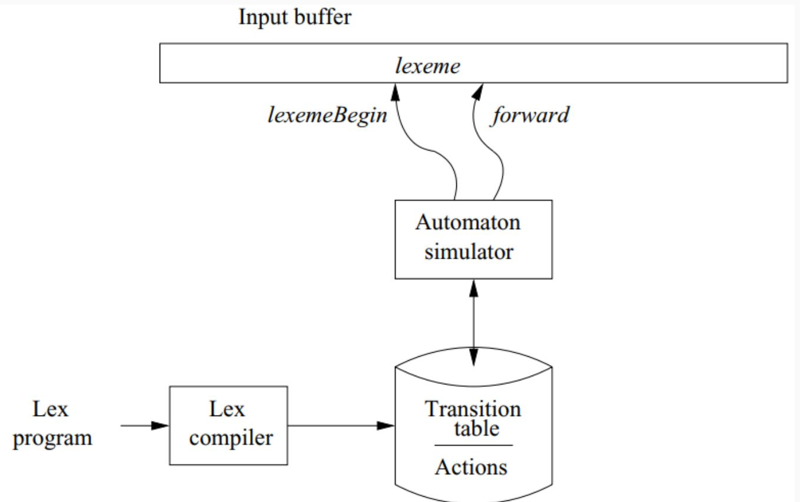

# <center> Automatic construction of Lexers

# <center>

#### Lexer Construction Steps

**Input: Token Specifications**
- A list of regular expressions (RE) in priority order that define the patterns of tokens in a programming language.

**Output: Lexer**
- A program that reads an input stream and breaks it up into tokens based on the specified regular expressions.

**Algorithm:**

1. **Convert REs into NFAs:**
   - Transform regular expressions into Non-deterministic Finite Automata (NFAs).
   - Each regular expression corresponds to an NFA that recognizes the language defined by that expression.

2. **Convert NFAs to DFA:**
   - Convert NFAs to Deterministic Finite Automata (DFAs) for efficiency.
   - Create a DFA that accepts the same language as the original NFA.

3. **Convert DFA into Transition Table:**
   - Create a transition table that represents the DFA.
   - The table indicates the next state for each combination of current state and input symbol.

#### The Lex/Flex Tool

- **Lex/Flex** is a powerful tool for generating lexical analyzers automatically.
- Lex programs describe the lexical analyzer to be generated.

**Structure of Lex Programs:**
```python

declarations
%%
translation rules
%%
auxiliary functions
```
**Translation Rules:**
- Each rule has the form: `Pattern { Action }`.
- Patterns are regular expressions, and actions are code fragments, typically in C.

#### Lex Architecture

- Describes how Lex works in terms of token recognition.
- Lex takes a set of regular expressions and corresponding actions to create a lexer.

# <center>


#### Regular Expression to NFA

- Illustrates the process of converting a regular expression to a Non-deterministic Finite Automaton (NFA).
- Each construct in the regular expression corresponds to a state transition in the NFA.


##### Regular Expressions (RE):

A regular expression is a concise way to describe a set of strings. It consists of:
- **Alphabet:** A set of symbols (characters).
- **Operators:** Specify operations to combine and manipulate sets of strings.
- **Special Symbols:** Representing operations like concatenation, union, and closure.

##### Nondeterministic Finite Automaton (NFA):

An NFA is a type of finite automaton that allows multiple transitions from a state on a given input symbol. It has states, transitions, and an initial and final state.

##### Steps to Convert RE to NFA:

1. **Base Cases:**
   - **Empty String (𝜖):** Create an NFA with two states (initial and final) and an 𝜖 transition between them.
   - **Single Symbol (a):** Create an NFA with two states, one initial and one final, with a transition labeled by the symbol.

2. **Concatenation (AB):**
   - If RE is AB, create NFAs for A and B.
   - Connect the final state of A to the initial state of B.

3. **Union (A | B):**
   - If RE is A | B, create NFAs for A and B.
   - Create a new initial state with 𝜖 transitions to the initial states of A and B.
   - Create a new final state with 𝜖 transitions from the final states of A and B.

4. **Kleene Closure (A*):**
   - If RE is A*, create an NFA for A.
   - Add a new initial state with 𝜖 transitions to the initial state of A and a 𝜖 transition from the final state of A to the initial state of A.

##### Example:

Let's convert the regular expression `(a|b)*abb` to an NFA:

1. **Base Cases:**
   - `a`: NFA1 (States: 2, Initial: 1, Final: 2, Transition: 1->2 (a))
   - `b`: NFA2 (States: 2, Initial: 1, Final: 2, Transition: 1->2 (b))
   - 𝜖: NFA𝜖 (States: 2, Initial: 1, Final: 2, Transition: 1->2 (𝜖))

2. **Concatenation (ab):**
   - Concatenate NFA1 and NFA2.

3. **Union (a|b):**
   - Create a new initial state with 𝜖 transitions to the initial states of NFA1 and NFA2.
   - Create a new final state with 𝜖 transitions from the final states of NFA1 and NFA2.

4. **Kleene Closure ((a|b)*):**
   - Add a new initial state with 𝜖 transitions to the initial state of the union NFA.
   - Add a 𝜖 transition from the final state of the union NFA to its initial state.

5. **Concatenation with `abb`:**
   - Concatenate the Kleene Closure NFA with the NFA for `abb`.

The resulting NFA accepts the language described by the regular expression.


#### Converting NFA to DFA

- Demonstrates the algorithm to convert NFAs to DFAs.
- Each set of possible states in the NFA becomes one state in the DFA, resulting in a more efficient representation.

#### DFA Minimization

**Intuition:**
- Two DFA states are equivalent if all subsequent behavior from those states is the same.

**Procedure:**
1. Create a table of state pairs.
2. Mark cells where one state is final and the other is non-final.
3. Mark pairs where transitions on the same symbol lead to marked pairs.
4. Repeat step 3 until no unmarked pairs remain.
5. Merge unmarked states to achieve a minimized DFA.

#### Resolving Ambiguities in Lexers

**Regular Expression Ambiguity:**
- Ambiguity arises when regular expressions can match input in multiple ways.

**Conflict Resolution in Lex:**
1. **Longest/Maximal Match Rule:**
   - Prefer a longer prefix over a shorter one.
2. **Declaration Priority:**
   - If the longest prefix matches multiple patterns, prefer the one listed first in the Lex program.

#### The Flex Manual

- An essential reference for using the Flex tool.
- It provides detailed information on the Flex tool and its capabilities.
- Refer to the provided appendix slide for in-depth insights.


