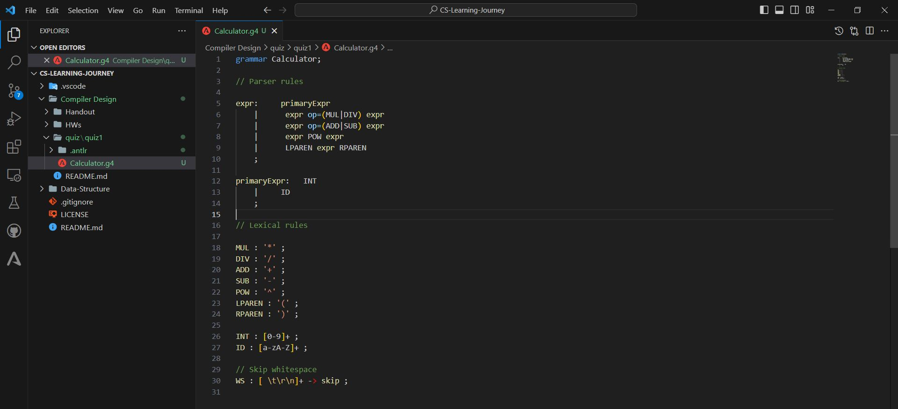
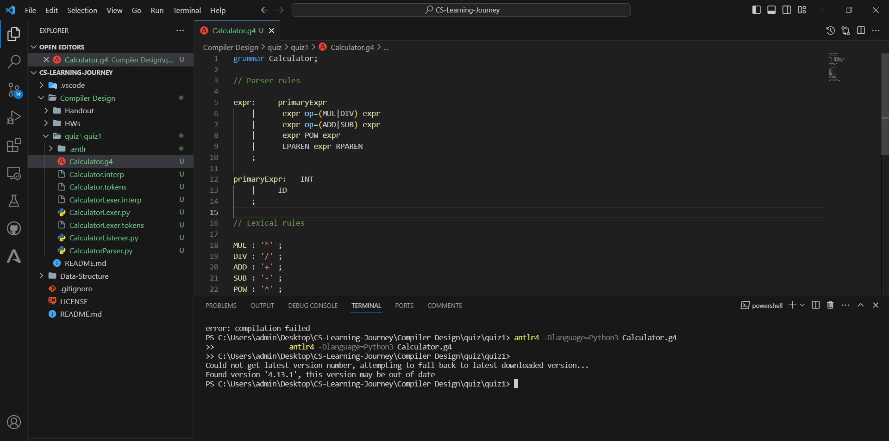
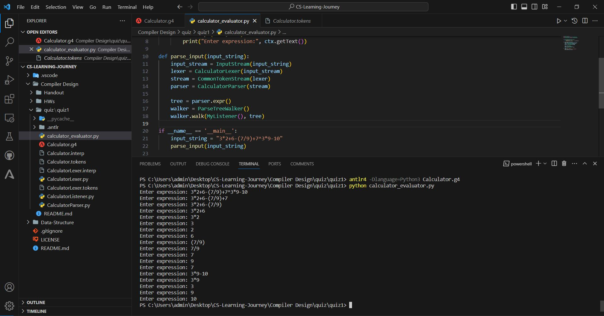

# Calculator Grammar (quiz1)

## Overview

This repository contains the ANTLR grammar for a calculator that can recognize and evaluate expressions involving the four basic operations (addition, subtraction, multiplication, and division), as well as parentheses and exponentiation. The grammar is designed to be used with the ANTLR parser generator.

## Table of Contents

- [Usage](#usage)
- [Parser Rules](#parser-rules)
- [Lexical Rules](#lexical-rules)
- [quiz write grammar picture](#quiz-write-grammar)
- [quiz generate python file picture](quiz-generate-python-file)
- [quiz I/O picture](quiz-I/O)

## Usage

To use this grammar, follow these steps:

1. Install ANTLR: Visit [ANTLR website](https://www.antlr.org/) for installation instructions.
2. Generate the parser: Run the ANTLR tool to generate the parser code in your preferred programming language (e.g., Python, Java).
3. Integrate with your project: Include the generated parser code in your project and use it to parse and evaluate mathematical expressions.

## Parser Rules

### `expr`

The `expr` rule represents a mathematical expression and supports the four basic operations, parentheses, and exponentiation.

### `primaryExpr`

The `primaryExpr` rule defines basic elements of an expression, such as integers (`INT`) and identifiers (`ID`).

## Lexical Rules

The lexical rules define the tokens used by the parser.

- `MUL`: Multiplication operator (*)
- `DIV`: Division operator (/)
- `ADD`: Addition operator (+)
- `SUB`: Subtraction operator (-)
- `POW`: Exponentiation operator (^)
- `LPAREN`: Left parenthesis (
- `RPAREN`: Right parenthesis )
- `INT`: Integer values (e.g., 123)
- `ID`: Identifiers (e.g., variable names)
- `WS`: Whitespace characters (skipped during parsing)

## quiz write grammar

## quiz generate python file

## quiz I/O

