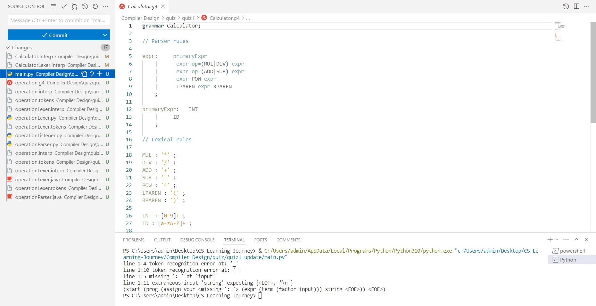

# Operation Grammar Parser

This project contains a simple parser for mathematical operations using the ANTLR4 tool. The parser can handle arithmetic operations, variable assignments, and basic string and number parsing.

## Description

The project consists of two parts: the ANTLR4 grammar definition and the Python script that uses the generated lexer and parser. The grammar defines the syntax for mathematical expressions, variable assignments, and basic string and number parsing. The Python script uses the ANTLR4 Python3 runtime to parse input strings according to the grammar.

## Installation

First, you need to install ANTLR4. Follow the instructions on the [ANTLR4 getting started guide](https://github.com/antlr/antlr4/blob/master/doc/getting-started.md) to install ANTLR4.

Next, generate the lexer and parser in Python by running the following command:

```bash
antlr4 -Dlanguage=Python3 operation.g4
```

This command generates `operationLexer.py`, `operationParser.py`, `operationListener.py`, and `operationVisitor.py`.

## Usage

To use the parser, you need to run the Python script. Before running the script, replace `"your_input_string"` in the `main()` function with the string you want to parse. Here's how to run the script:

```bash
python3 main.py
```

The script parses the input string according to the grammar and prints the parse tree.

## Credits

The grammar and the Python script were written by [Your Name]. The ANTLR4 tool was developed by the ANTLR team.

## License

This project is open source and available under the [MIT License](https://opensource.org/licenses/MIT).

## Tests

Tests for the parser are not included in this project. However, you can easily test the parser by providing different input strings and checking the printed parse trees.

## Features

The parser supports the following features:

- Arithmetic operations: addition, subtraction, multiplication, and division.
- Variable assignments.
- Basic string and number parsing.


## Badges


## output figure

