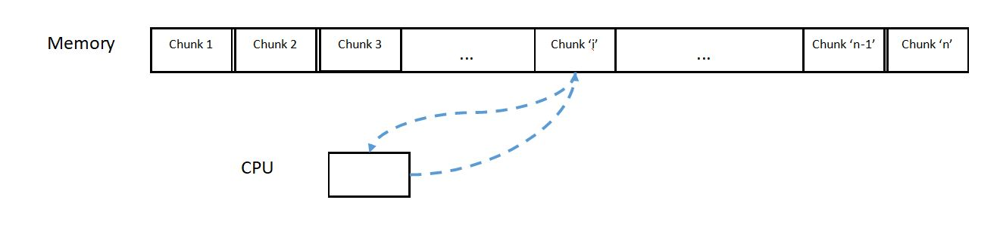

# 
Introduction

# 

The study of algorithms aims to discover efficient methods for problem-solving. This class has a twofold objective: not only to equip you with the skills to solve problems but also to teach you how to convey that a solution is both accurate and efficient.

**Defining the Problem:** A problem is a binary relation connecting problem inputs to ***correct*** outputs.

**Algorithm:** A deterministic algorithm is a systematic procedure that maps input values to ***single***, well-defined outputs. An algorithm is considered successful in solving a problem if it consistently produces correct outputs for all possible input scenarios. Although a problem input might have multiple valid outputs, an algorithm should return a single output for a given input, behaving like a `mathematical function`. For instance, consider the problem of identifying two students with the same birthday within your recitation group.

### Correctness:
Any computer program you write will have finite size, while an input it acts on may be arbitrarily large. Thus, every algorithm we discuss in this class will need to repeat commands in the algorithm via loops or recursion, and we will be able to prove correctness of the algorithm via induction.

***prove correctness of often Algorithms:***
- for first input check that is correct
- assume tha for `k` element is correct
- prove (argue) for `k + 1` element thats correct

### Efficient:

What makes a computer program efficient? One program is said to be more efficient than another if it can solve the same problem input using fewer resources. We expect that a larger input might take more time to solve than another input having smaller size. In addition, the resources used by a program, e.g. storage space or running time, will depend on both the algorithm used and the machine on which the algorithm is implemented. We expect that an algorithm implemented on a fast machine will run faster than the same algorithm on a slower machine, even for the same input. We would like to be able to compare algorithms, without having to worry about how fast our machine is. So in this class, we compare algorithms based on their asymptotic performance relative to problem input size, in order to ignore constant factor differences in hardware performance.

Asymptotic Notation:
Asymptotic notation allows us to disregard constants that remain unchanged with variations in the size of the problem input. We represent this concept using O(f(n)), which defines the set of functions with domains over natural numbers, adhering to the following property:

**O Notation:** A non-negative function, g(n), belongs to O(f(n)) if and only if there exists a positive real number, c, and a positive integer, n₀, such that g(n) ≤ c · f(n) for all n ≥ n₀. This definition imposes an upper limit on the asymptotic growth of a function for sufficiently large n. It remains true even if we were to scale or shift our function by a constant factor.

Conventionally, people often say that a function g(n) is O(f(n)) or equal to O(f(n)), but what they mean is set containment, i.e., g(n) ∈ O(f(n)). Since our problem's input size can be expressed as cn for some constant c, we can simplify and state that the input size is O(n) (order n). A similar notation applies to lower bounds.

**Ω Notation:** For a non-negative function, g(n), it is in Ω(f(n)) if and only if there exists a positive real number, c, and a positive integer, n₀, such that c · f(n) ≤ g(n) for all n ≥ n₀.

When one function both serves as an upper asymptotic bound and a lower asymptotic bound for another function, we employ Θ notation. If g(n) = Θ(f(n)), it signifies that f(n) precisely characterizes the growth of g(n).

**Θ Notation:** A non-negative g(n) is in Θ(f(n)) if and only if g(n) ∈ O(f(n)) ∩ Ω(f(n)).

To simplify the characterization of the asymptotic growth (i.e., asymptotic complexity) of common functions, we often use shorthand. This is illustrated in the table below, with the assumption that c ∈ Θ(1):

| Function       | Asymptotic Notation |
|----------------|----------------------|
| Constant       | O(1)                 |
| Logarithmic    | O(log n)             |
| Linear         | O(n)                 |
| Linearithmic   | O(n log n)           |
| Quadratic      | O(n^2)               |
| Cubic          | O(n^3)               |
| Exponential    | O(2^n)               |

This notation helps us analyze and compare the efficiency and growth rates of algorithms, abstracting away constant factors and hardware-dependent details.

# 

----------------------------------------------------------------------------------------
### Word RAM Model (Model Of Computation)
***RAM*** (***R***andom ***A***ccess ***M***emory) means Randomly Access to Memory in constant time.

***memory*** is just string of bits, its just a banch of 0's and 1's

# 

- basicly CPU can hold small chunk of information, but change that information
- CPU can operate on that information and also has instruction to randomly access different places in memory bring it into the CPU act on it and read it back
- in general we dont have address for every 8_bits (1_byte) in memory
- CPU can take chunk of information from memory that the chunk can much as 1_word (32_bit or 64_bit
- Specification for what operations on the machine can be performed in O(1) time 
- Model in this class is called the Word-RAM 
- Machine word: block of w bits (w is word size of a w-bit Word-RAM) 
- Memory: Addressable sequence of machine words 

### problem statement:

if I have 32_bit word_RAM, how many different address can I addressing?

***Answer:***
$$ 2^{32} bit \approx 4GB $$

if I have 64_bit word_RAM, how many different address can I addressing?

***Answer:***
$$ 2^{64} bit \approx 20exabyte $$

---------------------------------------------------------------------------------------
---------------------------------------------------------------------------------------

## Interface VS Data Structure

|Interface (API/ADT)            | Data structure                |
|-------------------------------|-------------------------------|
|what you want to do?           |how you do?                    |
|specification                  | representation                |
|what data can store?           |how to store Data?             |
|what opprations are suported?  |Algorithm to suport operations |
|problems                       | solutions                     |

---------------------------------------------------------------------------------------

## Exersice

Show that $$(log n)^a = O(n^b) $$ for all positive constants a and b. 

**Solution:** 
 It’s enough to show $$ \frac {n^b}{(\log n)^a} $$ limits to ∞ as n → ∞, and this is equivalent to 
arguing that the log of this expression approaches ∞: 
$$
[
\lim_{{n \to \infty}} \frac {n^b}{(\log b^n)^a} = \lim_{{n \to \infty}} (b \log n - a \log \log n) = \lim_{{x \to \infty}} (bx - a \log x) = \infty
]
$$
as desired. 
a Note: for the same reasons, $$ n = O(c^n) $$ for any c > 1.

